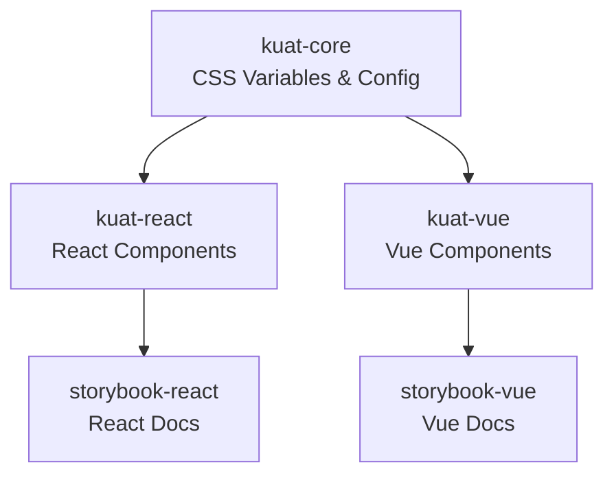
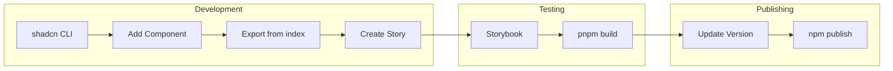

# Kuat Monorepo Architecture

## Overview

This monorepo uses Turborepo and pnpm workspaces to manage three packages that share design tokens and follow consistent patterns.

## Monorepo Structure

```
kuat-mono/
├── packages/
│   ├── kuat-core/     # Shared design tokens and CSS variables
│   ├── kuat-react/    # React component library
│   └── kuat-vue/      # Vue component library
├── apps/
│   ├── storybook-react/  # React component documentation and development
│   └── storybook-vue/    # Vue component documentation and development
├── docs/              # Documentation and agent guides
├── turbo.json         # Turborepo pipeline configuration
└── pnpm-workspace.yaml # pnpm workspace definition
```

## Package Dependency Graph



The core package provides design tokens that are consumed by both React and Vue component libraries. Storybook apps consume their respective component libraries for interactive documentation and development.

## Package Details

### @equal-experts/kuat-core

**Purpose**: Centralized design tokens and CSS variables shared across React and Vue packages.

**Key Files**:
- `src/variables.css` - CSS custom properties for theming (colors, spacing, etc.)
- `tailwind.config.ts` - Base Tailwind configuration

**Exports**:
- CSS variables via `@equal-experts/kuat-core/variables.css`
- Tailwind theme configuration

**Dependencies**: Minimal - only Tailwind CSS v4

### @equal-experts/kuat-react

**Purpose**: React component library built with shadcn/ui.

**Key Files**:
- `components.json` - shadcn/ui CLI configuration
- `src/lib/utils.ts` - Utility functions (cn helper)
- `src/styles.css` - Imports from @equal-experts/kuat-core and Tailwind
- `vite.config.ts` - Vite build configuration

**Dependencies**:
- React 18+
- Radix UI primitives
- shadcn/ui components (installed via CLI)
- `@equal-experts/kuat-core` (workspace dependency)

**Build**: Vite library mode with TypeScript

### @equal-experts/kuat-vue

**Purpose**: Vue component library built with shadcn-vue.

**Key Files**:
- `components.json` - shadcn-vue CLI configuration
- `src/lib/utils.ts` - Utility functions (cn helper)
- `src/styles.css` - Imports from @equal-experts/kuat-core and Tailwind
- `vite.config.ts` - Vite build configuration

**Dependencies**:
- Vue 3.4+
- Radix Vue primitives
- shadcn-vue components (installed via CLI)
- `@equal-experts/kuat-core` (workspace dependency)

**Build**: Vite library mode with TypeScript

## Design Token Flow

```
@equal-experts/kuat-core/src/variables.css
    ↓ (imported via CSS)
@equal-experts/kuat-react/src/styles.css
@equal-experts/kuat-vue/src/styles.css
    ↓ (used in components)
React/Vue Components
```

## Build Pipeline

Turborepo manages the build pipeline:
- `build`: Builds all packages in dependency order
- `dev`: Development mode with watch
- `lint`: Lints all packages

Dependencies are automatically resolved - `@equal-experts/kuat-react` and `@equal-experts/kuat-vue` depend on `@equal-experts/kuat-core`, so `@equal-experts/kuat-core` builds first.

### Storybook Apps

**Purpose**: Interactive component development and documentation environments.

**storybook-react** (`apps/storybook-react/`):
- Runs on http://localhost:6006
- Provides interactive playground for React components
- Includes stories for all React components
- Supports theme toggling (light/dark mode)

**storybook-vue** (`apps/storybook-vue/`):
- Runs on http://localhost:6007
- Provides interactive playground for Vue components
- Includes stories for all Vue components
- Supports theme toggling (light/dark mode)

**Key Features**:
- Live component preview
- Props/controls editing
- Accessibility testing
- Responsive viewport testing
- Theme switching
- Component documentation

## Technology Stack

- **Monorepo**: Turborepo
- **Package Manager**: pnpm workspaces
- **Build Tool**: Vite
- **Styling**: Tailwind CSS v4
- **Type System**: TypeScript
- **React Framework**: shadcn/ui
- **Vue Framework**: shadcn-vue
- **Documentation**: Storybook 8

## Development Workflow

### Complete Component Development Flow



### Adding a New Component

1. **Install via shadcn CLI**
   ```bash
   # For React
   cd packages/kuat-react
   npx shadcn@latest add dialog
   
   # For Vue
   cd packages/kuat-vue
   npx shadcn-vue@latest add dialog
   ```

2. **Export from index.ts**
   ```typescript
   // packages/kuat-react/src/index.ts
   export { Dialog, DialogTrigger, DialogContent } from "./components/ui/dialog";
   ```

3. **Create Storybook Story**
   ```typescript
   // apps/storybook-react/stories/Dialog.stories.tsx
   import type { Meta, StoryObj } from '@storybook/react';
   import { Dialog } from '@equal-experts/kuat-react';
   
   const meta: Meta<typeof Dialog> = {
     title: 'Components/Dialog',
     component: Dialog,
     tags: ['autodocs'],
   };
   
   export default meta;
   ```

4. **Test in Storybook**
   ```bash
   pnpm --filter storybook-react dev
   ```

5. **Build and Verify**
   ```bash
   pnpm build
   ```

### Local Development with Storybook

Storybook provides the best development experience:

```bash
# Start React Storybook
pnpm --filter storybook-react dev

# Start Vue Storybook
pnpm --filter storybook-vue dev

# Or run both with turborepo
pnpm dev
```

Features available in Storybook:
- Live component preview
- Interactive props/controls
- Theme switching (light/dark)
- Responsive viewport testing
- Accessibility checks
- Auto-generated documentation

### Testing in a Real Application

For testing components in an actual application:

1. **Build the packages**
   ```bash
   pnpm build
   ```

2. **Link locally**
   ```bash
   # In the monorepo
   cd packages/kuat-react
   pnpm link --global
   
   # In your test app
   pnpm link --global @equal-experts/kuat-react
   ```

3. **Or use file protocol**
   ```json
   {
     "dependencies": {
       "@equal-experts/kuat-react": "file:../kuat-mono/packages/kuat-react"
     }
   }
   ```

## Publishing Workflow

See [PUBLISHING.md](./PUBLISHING.md) for detailed publishing instructions.

**Quick Overview**:

1. Update version in package.json
2. Build all packages: `pnpm build`
3. Publish to npm: `npm publish --access public`
4. Create git tag: `git tag v0.2.0`
5. Push tag: `git push origin v0.2.0`

## Workspace Dependencies

Packages reference each other using workspace protocol:
```json
{
  "dependencies": {
    "@equal-experts/kuat-core": "workspace:*"
  }
}
```

This ensures local packages are used during development. When published to npm, these are replaced with actual version numbers.

## Build System Details

### Turborepo Tasks

Defined in `turbo.json`:

- **`build`**: Compiles all packages with dependency ordering
- **`dev`**: Runs development mode (Storybook apps)
- **`lint`**: Lints all packages
- **`build-storybook`**: Builds static Storybook sites

### Vite Configuration

Each package uses Vite for building:

- **Library mode**: Outputs ES modules
- **TypeScript**: Generates .d.ts files via `vite-plugin-dts`
- **CSS bundling**: Inlines CSS from `@equal-experts/kuat-core`
- **Externalized dependencies**: React/Vue and UI primitives

### Package Publishing

Packages are configured to publish only necessary files:

```json
{
  "files": ["dist", "README.md"],
  "exports": {
    ".": {
      "types": "./dist/index.d.ts",
      "import": "./dist/index.js"
    },
    "./styles": "./dist/style.css"
  }
}
```


